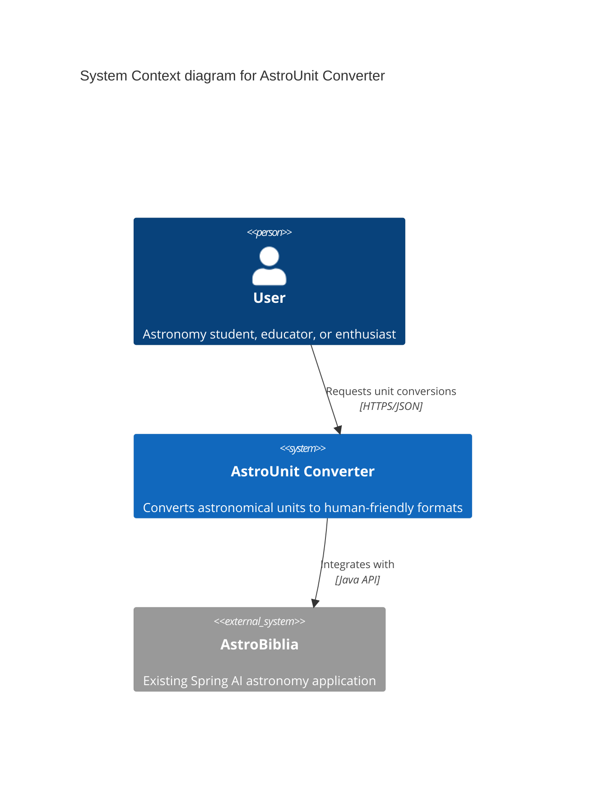

# Product Requirements Document for AstroUnit Converter

## Overview

**AstroUnit Converter** aims to convert astronomical measurements into human-friendly units, making cosmic distances and velocities easier to understand for students, educators, and space enthusiasts.

### Goals

- Convert astronomical units (AU, light-years, parsecs) to familiar distance units (kilometers, meters)
- Transform astronomical velocities (km/s) into everyday units (km/h)
- Express distances in light-time units (light-seconds, light-minutes, light-hours, light-years) for intuitive comprehension

---

## Functional Requirements

### FR1 Distance Unit Conversion

Convert astronomical distance units to kilometers and vice versa. Supported conversions include AU (Astronomical Units) to km, light-years to km, and parsecs to km. The system must use scientifically accurate conversion factors.

### FR2 Velocity Unit Conversion

Convert astronomical velocities from km/s to km/h and vice versa. This helps users understand speeds in more familiar terms, such as converting orbital velocities or escape velocities.

### FR3 Light-Time Distance Representation

Express any distance in light-time units (light-seconds, light-minutes, light-hours, light-days, light-years). This provides an intuitive way to understand cosmic distances by relating them to the time light takes to travel that distance.

### FR4 Input Validation

Validate that input values are positive numbers. Provide clear error messages for invalid inputs, including negative numbers, non-numeric values, or out-of-range values.

### FR5 Precision Formatting

Format conversion results with appropriate precision based on the magnitude of the result. Use scientific notation for very large or very small numbers to maintain readability.

### FR6 REST API Interface

Expose conversion functionality through RESTful endpoints that accept conversion parameters and return JSON responses with converted values and units.

---

## Technical Requirements

### Technical Stack

- **Language**: Java 21
- **Framework**: Spring Boot 3.5.7
- **API Design**: RESTful services
- **Build Tool**: Maven
- **Documentation**: OpenAPI/Swagger for API documentation

### TR1 Scientific Accuracy

All conversion factors must be based on IAU (International Astronomical Union) standards. Key constants include: 1 AU = 149,597,870.7 km, 1 light-year = 9,460,730,472,580.8 km, 1 parsec = 3.0857 × 10^13 km, speed of light = 299,792.458 km/s.

### TR2 Performance Requirements

Each conversion operation must complete in under 100ms for single conversions. The API should support concurrent requests with minimal latency impact. No database required for stateless conversion operations.

### TR3 Integration with Existing Application

The converter should integrate seamlessly with the existing Spring AI astronomy application (AstroBiblia) as an additional controller or service component, following the established package structure and naming conventions.

### TR4 API Response Format

All API responses must follow a consistent JSON structure including the original value and unit, converted value and unit, conversion factor used, and timestamp. Error responses must include appropriate HTTP status codes and descriptive error messages.

### TR5 Extensibility

The conversion service architecture should allow easy addition of new unit types and conversion factors without requiring significant refactoring. Use a strategy or factory pattern for conversion implementations.

## System C4 Context diagram

> End of PRD for AstroUnit Converter, last updated on November 5, 2025.
